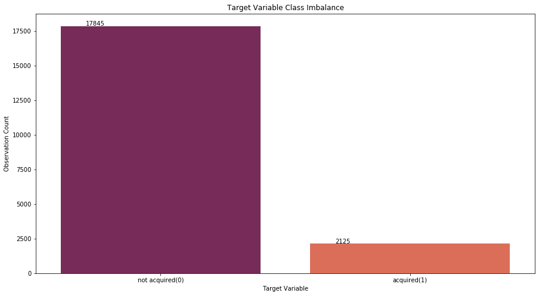

# Predicting Startup Acquisition 

**Authors**: [Brendan Ferris](mailto:brendanfrrs@gmail.com), [Michael Wirtz](mailto:michaelwirtz88@gmail.com)

## Overview

This project analyzes the needs of Butterfly Ventures, a micro VC fund that is looking to predict on the acquisition of startups. In an effort to model this problem, we collected a dataset of startups that fell into any one of the following three categories: closed, operating or acquired. In an effort to minimize the false negatives, we chose precision to be our target metric. Our baseline model using Logistic Regression had a precision score of 0.1. Our final and best model was a Random Forest model that had a precision score of 0.33. 

## Business Problem

Butterfly Ventures is small VC fund that is low on capital. Because of their limited funds, they are looking for a way to better filter companies in the hopes of making the most of their investments. They are aware of the following statistics: 75% of venture-backed startups fail. Under 50% of businesses make it to their fifth year. 33% of startups make it to the 10-year mark. Only 40% of startups actually turn a profit. Given this knowledge, Butterfly Ventures is targeting startups that they believe have the best opportunity at acquisition, a sure-fire way for investment profits. For this purpose, they have hired a group of data scientists to create a model predicting whether or not a startup will be acquired. 

## Data

 

In order to help Butterfly Ventures, we used a [Kaggle dataset](https://www.kaggle.com/arindam235/startup-investments-crunchbase) to use in our modeling process. The three given classification in the dataset were "closed," "operating," and "acquired."

<table>
<tr>
<th> Original Features </th>
</tr>
<tr>
<td>

<ul>
<li> <b>funding_total_usd</b>: total amount of money raised by the company.</li>
<li> <b>seed</b>: Seed rounds are among the first rounds of funding a company will receive, generally while the company is young and working to gain traction. Round sizes range between $10k–$2M, though larger seed rounds have become more common in recent years. A seed round typically comes after an angel round (if applicable) and before a company’s Series A round. </li>
<li> <b>venture</b>: money raised through venture capital.</li>
<li> <b>equity_crowdfunding</b>: Equity crowdfunding platforms allow individual users to invest in companies in exchange for equity. Typically on these platforms the investors invest small amounts of money, though syndicates are formed to allow an individual to take a lead on evaluating an investment and pooling funding from a group of individual investors.</li>
<li> <b>undisclosed</b>: mondey raised through undisclosed means.</li>
<li> <b>convertible_note</b>: A convertible note is an ‘in-between’ round funding to help companies hold over until they want to raise their next round of funding. When they raise the next round, this note ‘converts’ with a discount at the price of the new round. You will typically see convertible notes after a company raises, for example, a Series A round but does not yet want to raise a Series B round.</li>
<li> <b>debt_financing</b>: In a debt round, an investor lends money to a company, and the company promises to repay the debt with added interest.</li>
<li> <b>angel</b>: An angel round is typically a small round designed to get a new company off the ground. Investors in an angel round include individual angel investors, angel investor groups, friends, and family. </li>
<li> <b>grant</b>: A grant is when a company, investor, or government agency provides capital to a company without taking an equity stake in the company.</li>
<li><b>private_equity</b>: A private equity round is led by a private equity firm or a hedge fund and is a late stage round. It is a less risky investment because the company is more firmly established, and the rounds are typically upwards of $50M</li>
<li><b>round_A</b>: funding round for earlier stage companies and range on average between $1M–$30M. The value of the company is usually determined during the initial round of funding.</li>
<li><b>round_B</b>: funding round for earlier stage companies and range on average between $1M–$30M.</li>
<li><b>product_crowdfunding</b>: In a product crowdfunding round, a company will provide its product, which is often still in development, in exchange for capital. This kind of round is also typically completed on a funding platform.</li>

</ul>

</td>

</td>
</tr>
</table>

<table>
<tr>
<th> Engineered Features </th>
</tr>
<tr>
<td>

<ul>
<li> <b>days_from_founding_to_funding</b>: the amount of days that passed between the companies founding and when they were first able to secure funding.</li>
<li> <b>time_between_first_and_last_funding</b>: the amount of days that passed between the first time the company recieved funding and the last time the company recieved funding.</li>
<li> <b>month_<i>X</i></b>: the month that the company was founded.</li>
<li> <b>founded_quarter_<i>X</i></b>: the quarter (Q1,Q2,Q3,Q4) that the company was founded.</li>
<li> <b>state_code_<i>X</i></b>: the state the company was founded in.</li>
<li> <b>founded_year_<i>X</i></b>: the year the company was founded.</li>
<li> <b>url_ending_<i>X</i></b>: the domain name ending of the company website (.com, .org, etc)</li>
<li> <b>country_code_USA</b>: if the company was founded in the USA.</li>
</ul>

</td>
</tr>
</table>

<table>
<tr>
<th> Target </th>
</tr>
<tr>
<td>

<ul>
<li> <b>acquired (1)</b>: companies that were acquired.</li>
<li> <b>not acquired (0)</b>: companies that have either closed or are still operating.</li>
</ul>

</td>
</tr>
</table>

Because certain values possess overly predictive power, they were dropped from the models. Those columns are as follows: 

<table>
<tr>
<th> Removed From Original Dataset </th>
</tr>
<tr>
<td>

<ol>
<li> <b>post_ipo_equity</b>: A post-IPO equity round takes place when firms invest in a company after the company has already gone public.</li>
<li> <b>post_ipo_debt</b>: A post-IPO debt round takes place when firms loan a company money after the company has already gone public. Similar to debt financing, a company will promise to repay the principal as well as added interest on the debt.                 </li>
<li> <b>round_C through round_F</b>: companies that that move forward to more advanced stages of funding.</li>
</ol>

</td>
</tr>
</table>

## Methods

Overall, this project analyzes the given dataset information to maximize the precision metric of our models. 

In order to get the most out of our column data, we dummied all of the categorical columns. We presumed that the category list column would be the most beneficial to our model, given that it would be able to classify each startup specifically into business-type categories. 

Because there was high class imbalance, we upsampling and downsampling techniques to even out the True and False classes.

For our logistic regression models we also standardized the continous values because they were throwing off the models with their extremely different values. 

## Results

Our results had two stages: 

First, we trained our models and predicted on the test set. Because our test set was balanced, we received some pretty impressive results. Our models showed precision scores close to 0.9. 

Second, we predicted on the holdout set. The results here were vastly different. We beleive that this is because the class imbalance was just so high. Due to this fact, our precision score fell dramatically below 0.5, with our best model having a precision score on the holdout set of 0.32. 

## Conclusion

The conclusions that can be drawn given our results are the following:

- Predicting a quality precision score on startup acquisition requires way more data
- There are only small tangible differences that make the difference between an acquired startup and a startup that is not acquired
- Given the complexity of this task, there is a vast amount of data required. If a high precision score was possible given the small dataset that we used, all VC firms would be wildly successful.

### Next Steps

- Use a more interpretable model to find out which characteristics are most highly correlated with startup acquisition
- scrape data on startup management to get an indication of how that can affect acquisition 
- Overall: get more data! 

## For More Information

See the full analysis in the [Jupyter Notebook](./code_success_movie.ipynb) or review this [presentation](./slides_successful_movie.pdf).

For additional info, contact Brendan Ferris or Michael Wirtz at
[brendanfrrs@gmail.com](mailto:brendanfrrs@gmail.com) and [michaelwirtz88@gmail.com](mailto:michaelwirtz88@gmail.com), respectively

## Repository Structure
<pre>
├── README.md
├── archive
│   ├── EDA_large_notebook.ipynb
│   ├── EDA_notebook.ipynb
│   ├── cleaning_startup_csv.ipynb
│   ├── holdout_bf.ipynb
│   ├── mike_modeling.ipynb
│   ├── model_bf.ipynb
│   ├── modeling_master.ipynb
│   └── visualizations_bf.ipynb
├── data
│   ├── cleaned_dummied_startup_data.csv
│   ├── holdout_startup_data.csv
│   ├── investments_VC.csv
│   ├── startup_data.csv
│   └── training_startup_data.csv
├── images
│   ├── external-content.duckduckgo.com.jpg
│   ├── startup_acquisitions_blue.jpeg
│   └── startup_acquisitions_red.jpeg
├── modeling_master.ipynb
└── pickled_models
    ├── boost_model_bf_1.pkl
    ├── scaler_1.pkl
    └── smote_model_bf_1.pkl</pre>